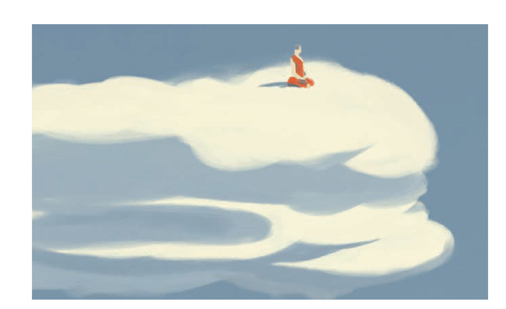

 SOURCE: https://4fishgreenberg.medium.com/quitting-facebook-changed-my-life-1419d7827f72

Paul Greenberg
2022/FEB/04

---

 Meta’s stock collapse revealed what I already knew

 

 I quit Facebook, Instagram and every other property owned by what is now called Meta nearly two years ago. It was at the time a rash decision and at first many of my friends and family wondered where I had “gone.” Soon, though, the people who mattered “found” me. It wasn’t a hard thing to do. I was always here. Soon after that, the daily flow of my life started to change.

 

    I wonder if others are starting to see the complete and utter uselessness of a tool that has come to dominate our waking lives and even invade our dreams.
 
 

 With Meta recently losing over $200 billion and announcing that membership is beginning to contract for the first time, I wonder (hope?) if others are starting to see the complete and utter uselessness of a tool that has come to dominate our waking lives and even invade our dreams.

 Probably I’m jumping the gun. Probably you will all raise an eyebrow and then go back to scrolling. But before you do, I thought I’d just lay out here some things that have changed for me since saying goodbye to Zuckerberg and Co.

 Here goes:
 1. I get the news from reporters who are professionally trained to discern bullshit from reality
 2. I read the news once in the morning and call it a day
 3. I am the first out of the house on a bike or a run
 4. I am the last to hear about my brother’s friend’s sister’s baby’s skinned knee
 5. I don’t like anything
 6. I don’t dislike anything
 7. I don’t share anything
 8. I use actual words to describe specific feelings that are unique to a particular moment in time
 9. I spend my vacations looking at things rather than photographing things so that other people can look at those things
 10. I no longer see the vacations of others
 11. I write more than ever and receive more requests for my writing than ever
 12. I don’t give a shit about Wordle
 13. I look at my own cat when she does something cute
 14. I pet my cat if she’s particularly cute
 15. I call my friends to find out how they are doing
 16. When I do this they often share something with me that they would never share on social media
 17. I brag in person and suffer the consequences
 18. I have no idea how my exes are doing
 19. I don’t carry around in my head the ravings of someone I’ve never met
 20. At night I close my eyes and dream of real people

 More on quitting things [here](http://www.goodbyephone.com).
